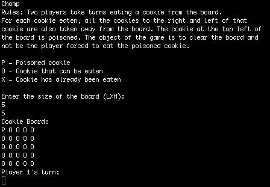
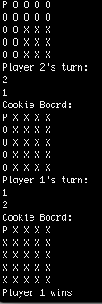

# Chomp
In this strategic two-player game, cookies are laid out on a rectangular grid. The cookie in the top left corner is poisoned.
Players take turns selecting a cookie from the board. As a result all the cookies to the right and down from the chosen cookie
are also removed from the board. The game continues until there are no cookies left on the board. The object of the game is 
force your opponent to take the poisoned cookie. 

## Screenshots of the Game

## How to download and play Chomp
1. Clone the repo
2. Run file

  For Mac:
  * Open a terminal and cd into the directory with the chomp.jar file (in the repo you just cloned)
  * Type `java -jar chomp.jar` then `Enter` to start game
  
  For Windows:
  * Press the Win key + X hotkey and select Command Prompt (Admin) to open it as administrator
  * Then input `java -jar c:path\to\jar\file\chomp.jar` in the CP and press `Enter`
  * I have not personally tried this on a Windows machine but found instructions [here](https://windowsreport.com/jar-file-windows/#2)
  
